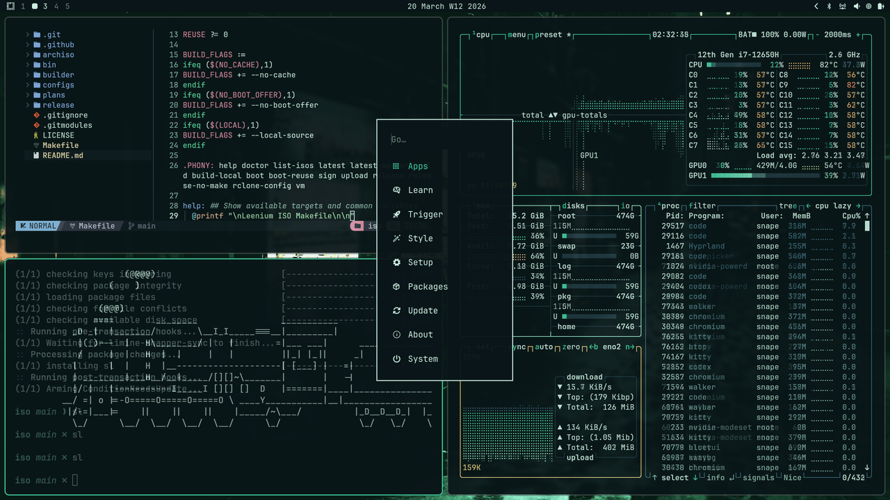
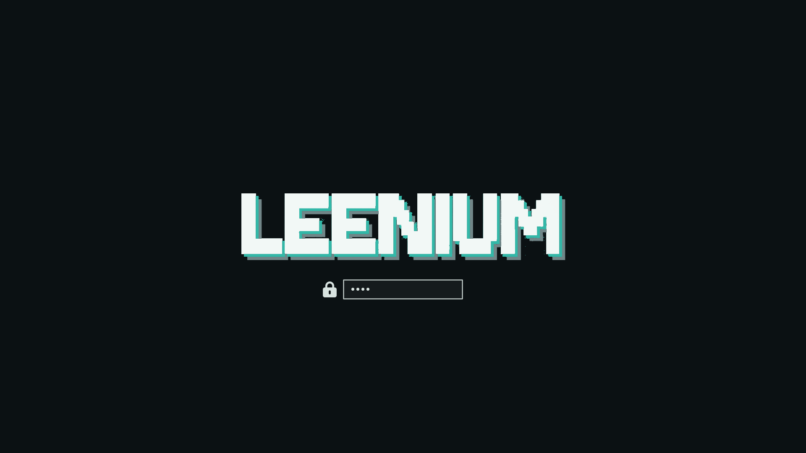

<div align="center">


A dark, shared-palette theme for [Omarchy](https://github.com/basecamp/omarchy). Deep slate backgrounds with cyan, teal, emerald, and blue accents.

Hosted under `github.com/drunkleen/leenium.omarchy`.




</div>

## Color Palette

### Primary

| Role | Hex | |
|---|---|---|
| Background | `#0b1113` |  |
| Surface | `#11191c` |  |
| Overlay | `#182326` |  |
| Muted | `#718688` |  |
| Foreground | `#d8e3e0` |  |
| Accent (Teal) | `#33b8a8` |  |
| Cyan | `#59d6c5` |  |
| Blue | `#5e9bff` |  |
| Yellow | `#d9c76b` |  |
| Red | `#e16f73` |  |

### Secondary

| Role | Hex | |
|---|---|---|
| Void | `#020405` |  |
| Ink | `#0e1518` |  |
| Shell | `#141e21` |  |
| Line | `#223033` |  |
| Fog | `#a4b4b2` |  |
| Mint Glow | `#4dba7a` |  |
| Mint Mist | `#5ccbbb` |  |
| Aqua | `#71e4d8` |  |
| Amber | `#d9c76b` |  |
| Coral | `#e16f73` |  |

---

## What's Included

| File | Applies to |
|---|---|
| `colors.toml` | Omarchy color definitions (terminal, UI) |
| `btop.theme` | btop system monitor |
| `chromium.theme` | Chromium / Chrome NTP accent |
| `waybar.css` | Waybar status bar color variables |
| `swayosd.css` | SwayOSD on-screen display (volume, brightness) |
| `neovim.lua` | Neovim via [leenium.nvim](https://github.com/drunkleen/leenium.nvim) |
| `vscode.json` | VS Code color customizations |
| `icons.theme` | Icon pack (`Yaru-olive`) |
| `backgrounds/` | 6 wallpapers |

### Backgrounds

- `leenium.png` — abstract dark signature wallpaper
- `artificial-valley.jpg` — misty mountain valley
- `creation.png` — artistic generative
- `dresden.png` — Dresden cityscape
- `london.png` — London cityscape
- `rasht.png` — Rasht cityscape

---

## Installation

```bash
omarchy theme install https://github.com/drunkleen/leenium.omarchy
```

Or manually clone into your Omarchy themes directory:

```bash
git clone https://github.com/drunkleen/leenium.omarchy \
  ~/.local/share/omarchy/themes/leenium
omarchy theme apply leenium
```

---

## The Leenium Ecosystem

Leenium is a unified dark desktop environment built around the same color palette. Alongside this Waybar theme, the project ships matching configs for:

- [**Firefox**](github.com/drunkleen/leenium.firefox) - browser theme extension
- [**Ghidra**](github.com/drunkleen/leenium.ghidra) - reverse engineering framework theme
- [**Hyprlock**](github.com/drunkleen/leenium.hyprlock) - hyprland lockscreen
- [**Limine**](github.com/drunkleen/leenium.limine) - BootLoader
- [**Neovim**](github.com/drunkleen/leenium.nvim) - syntax highlights and UI elements
- [**OpenCode**](github.com/drunkleen/leenium.opencode) - terminal-first theme
- [**VS Code**](github.com/drunkleen/leenium.vscode) - editor theme and UI palette
- [**Waybar**](github.com/drunkleen/leenium.waybar) - editor theme and UI palette

Visit [github.com/drunkleen](https://github.com/drunkleen) or [leenium.drunkleen.com](https://leenium.drunkleen.com/) to explore the full setup.


<p align="center">
    Copyright &copy; 2026-present <a href="https://github.com/drunkleen" target="_blank">LEENIUM</a>
</p>
<p align="center">
    <a href="https://github.com/drunkleen/leenium.webpage/blob/master/LICENSE">
        
    </a>
</p>
